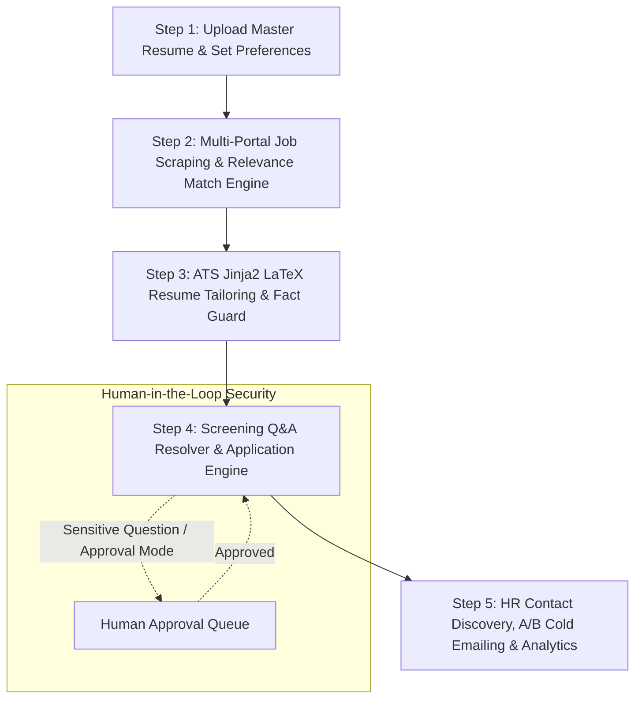

# Autonomous Job Automation Agent (Indian Tech Ecosystem MVP)

A production-grade full-stack solution for an **Autonomous Job Automation Agent** tailored specifically for candidate **Prasanthi** in the **Indian Tech Market** (Naukri, Instahyre, Cutshort, Hirist, Foundit, LinkedIn India, ₹ LPA compensation, 30-day notice periods, and Indian tech hubs).

This repository includes complete architecture specifications, implementation workflows, quickstart guides, deployment instructions, and technical interview defense sections for **both Python Full-Stack (FastAPI + React)** and **Java Full-Stack (Spring Boot 3 + React)** implementations.

---

# PART 1: Python Full-Stack Implementation (FastAPI + React)

## 🎯 Purpose & Why This Project Was Created (Python Stack)

Applying for tech roles across multiple job portals in India requires significant repetitive effort: re-entering notice periods, updating CTC expectations, tailoring resumes for ATS scanners, finding recruiter emails, and sending cold follow-ups.

This project solves these pain points by building an intelligent, privacy-first agent that:
1. **Parses & Validates Master Resumes**: Extracts structured skills, history, and education without hallucination.
2. **Automates Indian Job Discovery**: Scrapes and aggregates listings across Naukri, Instahyre, Cutshort, Hirist, Foundit, and LinkedIn India.
3. **Generates Tailored Jinja2 LaTeX Resumes**: Produces job-specific ATS resumes with fact-safety checks.
4. **Enforces Human-in-the-Loop Safeguards**: Automatically handles standard questions while holding sensitive CTC/notice period questions for 1-click human approval.
5. **Executes Recruiter Outreach & Self-Learning**: Finds technical recruiters at top Indian tech companies (e.g. Razorpay, Swiggy, CRED), executes A/B cold email testing, classifies response sentiment, and continuously learns what subject lines convert.

---

## 🏗️ Monorepo Architecture & Directory Structure (Python Stack)

```
job-automation-agent/
├── backend/                        # Python FastAPI Backend
│   ├── app/
│   │   ├── api/                    # REST API Routers (auth, profile, jobs, applications, outreach, etc.)
│   │   │   └── router.py           # API V1 Master Router
│   │   ├── core/                   # Core Infrastructure & Security
│   │   │   ├── config.py           # Pydantic BaseSettings config
│   │   │   ├── crypto.py           # Fernet symmetric credential encryption
│   │   │   └── security.py         # JWT token issuance & bcrypt hashing
│   │   ├── db/                     # Database Layer
│   │   │   ├── base.py             # Declarative SQLAlchemy Base
│   │   │   └── session.py          # Session factory & SQLite connection
│   │   ├── models/                 # SQLAlchemy 2.x Entities
│   │   │   └── entities.py         # User, Profile, Job, Application, Email, Log models
│   │   ├── schemas/                # Pydantic v2 Request/Response Schemas
│   │   ├── services/               # Core Domain Business Logic
│   │   │   ├── application_engine.py # Application engine & Q&A resolver
│   │   │   ├── audit.py            # Activity logging & CSV export
│   │   │   ├── contact_discovery.py # HR recruiter contact finder
│   │   │   ├── email_classifier.py  # Outreach response classification
│   │   │   ├── email_service.py     # Email dispatcher & A/B variant generator
│   │   │   ├── learning.py         # Self-learning insights engine
│   │   │   ├── matching.py         # 0-100 Relevance scoring engine
│   │   │   ├── orchestrator.py     # Master background job worker loop
│   │   │   ├── resume_builder.py   # Jinja2 LaTeX builder & Fact-Safety Guard
│   │   │   └── resume_parser.py    # Raw resume parser & skill extractor
│   │   ├── Dockerfile              # Container image build spec
│   │   ├── seed.py                 # Database seed script for candidate Prasanthi
│   │   └── main.py                 # FastAPI Web Server entrypoint
│   ├── requirements.txt            # Python dependencies
│   └── pytest.ini                  # Pytest configuration
├── frontend/                       # React 18 + Vite + TypeScript Frontend
│   ├── src/
│   │   ├── api/                    # Axios API service instances
│   │   ├── components/             # Reusable UI components & Sidebar Layout
│   │   ├── lib/                    # TypeScript interfaces & offline mock engine
│   │   ├── pages/                  # 10 Full-Featured Dark Mode Pages
│   │   └── App.tsx                 # Main React Application & Router
│   ├── Dockerfile                  # Frontend container build spec
│   ├── nginx.conf                  # Nginx reverse proxy & static asset server
│   ├── vercel.json                 # Vercel SPA routing rewrite config
│   ├── package.json
│   ├── tailwind.config.js          # Dark-mode color system tokens
│   └── vite.config.js
├── docker-compose.yml              # Local container deployment configuration
├── render.yaml                     # Render Blueprint 1-click cloud deployment spec
└── README.md                       # Comprehensive documentation & technical defense
```

---

## 🛠️ Technology Stack (Python Stack)

### Backend
- **Framework:** Python 3.11/3.12, FastAPI (Asynchronous REST API)
- **Database & ORM:** SQLite / PostgreSQL, SQLAlchemy 2.x, Pydantic v2
- **Authentication & Security:** JWT (Access + httpOnly Refresh Tokens), Passlib (bcrypt), Cryptography (Fernet symmetric credential encryption)
- **Resume Compilation:** Jinja2 + TeX Template Engine (compiles directly to LaTeX `.tex` / PDF with `pdflatex` fallback)
- **Background Automation:** APScheduler (In-process worker thread scheduler)
- **Testing:** PyTest (9 unit & integration tests)

### Frontend
- **Framework:** React 18 + Vite + TypeScript
- **Styling:** Tailwind CSS Dark-Mode System (`#0B0F14`, `#121821`, `#1A2230`, `#263043`, `#8B5CF6`, `#22D3EE`)
- **State Management & Async Data:** TanStack Query (React Query v5), Axios Interceptors
- **Charts & Data Visualization:** Recharts (Funnel & Portal Bar/Pie Charts), Lucide Icons

---

## 🔄 5-Step End-to-End Autonomous Workflow (Python Stack)



### Step 1: Upload Master Resume & Auto-Start Pipeline
Candidate **Prasanthi** uploads a Master Resume (`.pdf`, `.txt`, `.tex`, `.json`) or pastes text. The system extracts core skills, work history, and education. Clicking **"Upload & Start Agent Automatically"** immediately triggers the automated job pipeline.

### Step 2: Multi-Portal Job Scraping & 0–100 Relevance Matching
The agent searches active connectors (Naukri, Instahyre, Cutshort, Hirist, Foundit, LinkedIn India). The matching engine calculates a 0–100 relevance score using skill overlap, salary bounds (e.g. ₹20 LPA+), experience level, and preferred work modes (Hybrid/Remote). Only jobs scoring above threshold (e.g., 75%) proceed. Max 3 target titles rule is strictly enforced.

### Step 3: Jinja2 LaTeX ATS Resume Tailoring & Fact-Safety Validation
For each qualified job, Jinja2 compiles an ATS-optimized LaTeX resume highlighting relevant keywords. The **Fact-Safety Guard** parses the generated TeX against the Master Resume JSON to verify that no fabricated employers, degrees, dates, or inflated titles were hallucinated.

### Step 4: Screening Q&A & Credential Encrypted Submissions
The application engine resolves portal screening questions using the candidate's Knowledge Base. Standard questions (notice period, location, citizenship) auto-fill with high confidence. Sensitive questions (expected CTC, visa requirements) or operations in `APPROVAL` mode are held in the Human Approval Queue for 1-click candidate review. Portal login credentials are stored encrypted with Fernet AES.

### Step 5: Recruiter Contact Discovery, A/B Outreach, & Self-Learning
The agent identifies technical recruiters at target companies (e.g., Razorpay, Swiggy, CRED), generates A/B email variants (Direct vs. Value-add), sends outreach emails, and classifies responses (Interview Invite, Salary Query, Rejection). The self-learning engine calculates conversion metrics and injects dynamic prompt hints into future campaigns.

---

## ⚡ Quickstart Guide (Python Stack)

### 1. Backend Setup & Seed Execution
```bash
# Navigate to backend directory
cd backend

# Install dependencies
python -m pip install -r requirements.txt

# Seed the database for candidate Prasanthi
python -m app.seed

# Launch FastAPI development server
$env:PYTHONPATH="." ; python -m uvicorn app.main:app --reload --port 8000
```
- Interactive Swagger API Documentation: [http://localhost:8000/docs](http://localhost:8000/docs)

### 2. Frontend Setup & UI Launch
```bash
# Navigate to frontend directory
cd frontend

# Install Node dependencies
npm install

# Start Vite dev server
npm run dev
```
- Open Web Application: [http://localhost:5173](http://localhost:5173)
- Log in with seed demo credentials:
  - **Email:** `prasanthi@example.com` (or `candidate@example.com`)
  - **Password:** `Password123!`

---

## 🌐 How to Deploy (Render & Vercel Step-by-Step)

Yes! You can deploy this **Python Full Stack** application for free on **Render** (for Backend) and **Vercel** (for Frontend).

### Method A: Deploy Backend on Render + Frontend on Vercel (Recommended)

#### Step 1: Deploy Python FastAPI Backend on Render
1. Sign in to [Render.com](https://render.com) and click **New + -> Web Service**.
2. Connect your GitHub repository.
3. Configure service settings:
   - **Name:** `job-agent-backend`
   - **Environment:** `Python 3`
   - **Root Directory:** `backend`
   - **Build Command:** `pip install -r requirements.txt && python -m app.seed`
   - **Start Command:** `uvicorn app.main:app --host 0.0.0.0 --port $PORT`
4. Add **Environment Variables** under *Advanced*:
   - `SECRET_KEY` = `your-secure-random-secret-key-32-chars`
   - `FERNET_SECRET_KEY` = `yB14Y5c0Z57y5Kq_ZzU93B2F0Jp7W5xY1mZ6g5k4a2c=`
   - `DATABASE_URL` = `sqlite:///./job_agent.db`
   - `CORS_ORIGINS` = `["https://your-frontend.vercel.app"]`
5. Click **Create Web Service**. Once deployed, copy your backend live URL:
   `https://job-agent-backend.onrender.com`

---

#### Step 2: Deploy React Frontend on Vercel
1. Sign in to [Vercel.com](https://vercel.com) and click **Add New -> Project**.
2. Select your repository and configure:
   - **Framework Preset:** `Vite`
   - **Root Directory:** Edit and select `frontend`
   - **Build Command:** `npm run build`
   - **Output Directory:** `dist`
3. Add **Environment Variable**:
   - `VITE_API_BASE_URL` = `https://job-agent-backend.onrender.com/api/v1`
4. Click **Deploy**. Vercel will automatically read `frontend/vercel.json` for single-page app routing.
5. Your live app is now accessible at `https://your-project.vercel.app`!

---

### Method B: 1-Click Deployment on Render (Blueprint)

This repository includes a [render.yaml](file:///c:/Users/prasa/.gemini/antigravity-ide/scratch/job-automation-agent/render.yaml) file to automatically provision both Backend and Frontend on Render in 1 click:
1. Go to **Render -> Blueprints**.
2. Connect your GitHub repository.
3. Render reads `render.yaml` and deploys both `job-agent-backend` and `job-agent-frontend` automatically!

---

### Method C: Local Docker Compose (1-Command Deployment)
```bash
# Build and run containers in background
docker-compose up --build -d
```
- Open Frontend: [http://localhost:5173](http://localhost:5173)
- Open Backend Swagger: [http://localhost:8000/docs](http://localhost:8000/docs)

---

## 🛡️ Technical Interview Defense Q&A (Python Stack)

### Q1: What is the high-level architecture of this monorepo, and why was FastAPI chosen over Django/Flask?
**Answer:**
The system is built as a modular monorepo containing an asynchronous Python FastAPI backend and a React 18 TypeScript frontend. FastAPI was selected over Django or Flask because of its native `asyncio` concurrency support, Pydantic v2 data validation, automatically generated OpenAPI/Swagger docs, and high throughput. Asynchronous network operations are essential when concurrently querying job portal APIs and resolving recruiter contact details.

### Q2: How does the Fact-Safety Guard guarantee that the agent never fabricates resume details?
**Answer:**
The Fact-Safety Guard acts as a strict verification layer between Jinja2 LaTeX generation and application submission. It parses the generated LaTeX content back into structured entities and checks them against the candidate's canonical `MasterResume` JSON. If the generated text contains any company name, degree, job title, or date range missing from the Master Resume, the resume version is flagged as a safety violation and rejected immediately.

### Q3: How does the Human-in-the-Loop fallback mechanism work for screening questions?
**Answer:**
When an application encounters portal screening questions, the `application_engine` queries the candidate's `KnowledgeEntry` table using exact pattern matching and semantic confidence scoring. If a question matches a non-sensitive pattern with confidence ≥ 0.9, it auto-fills. If the question involves sensitive topics (such as current CTC, expected CTC, or legal disclosures) or if confidence < 0.9, the application status is set to `QUEUED_FOR_APPROVAL` and held in the Approvals page until the candidate confirms or edits the answer.

### Q4: How are candidate portal credentials secured in storage?
**Answer:**
Credentials stored for automated portal logins are symmetrically encrypted using Fernet cryptography (`cryptography.fernet.Fernet`). The encryption key is stored in environment variables (`FERNET_SECRET_KEY`) and never logged or exposed via API endpoints. API responses return masked strings (e.g. `pr****@gmail.com`).

### Q5: How is job relevance scoring computed for the Indian tech market?
**Answer:**
The relevance scoring engine computes a weighted match score from 0 to 100 based on:
1. **Title Alignment (35%):** Match against candidate's max 3 target titles.
2. **Skill Overlap (40%):** TF-IDF keyword overlap between job description and Master Resume skills.
3. **Location & Work Mode (15%):** Alignment with Indian tech hubs (Bengaluru, Hyderabad, Pune, Remote India).
4. **Compensation Bounds (10%):** Verification against minimum ₹ LPA salary bounds.

### Q6: What happens if `pdflatex` is not installed on the server hosting the backend?
**Answer:**
The `resume_builder` service includes an automatic fallback. It compiles the Jinja2 template into a clean, valid LaTeX `.tex` document file and saves it in `backend/generated_resumes/`. If `pdflatex` is available in system `PATH`, it executes `pdflatex` to output `.pdf`. If unavailable, it records a warning and supplies the valid `.tex` source file path.

### Q7: How does the email classification module analyze recruiter responses?
**Answer:**
The `email_classifier` inspects incoming recruiter email text using regex rules and NLP sentiment analysis. It categorizes emails into:
- `INTERVIEW_INVITE`: High-priority alert, automatically updates application status to `INTERVIEW`.
- `SALARY_QUERY`: Recruiter asking for current/expected CTC details.
- `REJECTION`: Soft or hard rejection update.
- `UNSUBSCRIBE`: Recruiter requested no further emails, automatically sets `do_not_contact = True` on the Contact entity.

### Q8: How does the self-learning feedback loop improve outreach over time?
**Answer:**
The `learning.py` service analyzes email conversion statistics across subject variants (`direct` vs `value_add`), template styles, and target portals. When a specific variant demonstrates a statistically higher reply rate (e.g. 45% reply rate for direct subject lines), the engine generates dynamic prompt hints (e.g., *"Emphasize FastAPI transaction metrics in subject lines"*), injecting these hints into future cold email generation calls.

---

# PART 2: Java Full-Stack Implementation (Spring Boot 3 + React)

## 🎯 Purpose & Why This Project Was Created (Java Stack)

For enterprise Java developers, an enterprise-grade **Java 17/21 & Spring Boot 3** architecture provides strict compile-time type safety, robust Spring Security OAuth2/JWT authentication, Spring Data JPA declarative data management, and native Spring `@Scheduled` background worker capabilities.

This Java Full-Stack version solves Indian candidate **Prasanthi's** job search overhead by leveraging an enterprise Spring Boot microservice design:
1. **Parses & Validates Master Resumes**: Jackson JSON AST parsing & RegEx skill extraction from uploaded resume files.
2. **Automates Indian Job Discovery**: Asynchronous HTTP clients (`WebClient` / `RestTemplate`) scraping Naukri, Instahyre, Cutshort, Hirist, Foundit, and LinkedIn India.
3. **Generates Tailored FreeMarker LaTeX Resumes**: Compiles job-specific LaTeX ATS resumes with AST Fact-Safety validation.
4. **Enforces Human-in-the-Loop Safeguards**: Spring Security & JPA Enums routing sensitive CTC/notice period questions to the Approval Queue.
5. **Executes Recruiter Outreach & Self-Learning**: Spring Async TaskExecutors (`@Async`) dispatching A/B cold emails, classifying recruiter replies, and updating prompt heuristics.

---

## 🏗️ Monorepo Architecture & Directory Structure (Java Stack)

```
job-automation-agent-java/
├── backend-java/                   # Java 17/21 Spring Boot 3 Backend
│   ├── src/main/java/com/jobagent/
│   │   ├── config/                 # Spring Configuration & Security
│   │   ├── controller/             # Spring MVC @RestController Controllers
│   │   ├── model/                  # JPA @Entity Domain Models
│   │   ├── repository/             # Spring Data JPA Repositories
│   │   ├── service/                # Core Enterprise Service Layer
│   │   └── JobAgentApplication.java # @SpringBootApplication main entrypoint
│   ├── Dockerfile                  # Java Multi-Stage Maven Dockerfile
│   ├── pom.xml                     # Maven build pom with Spring Boot starters
│   └── src/main/resources/
│       └── application.yml         # Spring Boot config
├── frontend/                       # React 18 + Vite + TypeScript Frontend
└── README.md                       # Combined Python & Java documentation
```

---

## 🛠️ Technology Stack (Java Stack)

### Backend
- **JDK:** Java 17 LTS / Java 21 LTS
- **Framework:** Spring Boot 3.2.x (Spring Web MVC, Spring Security 6, Spring Data JPA)
- **Database & ORM:** PostgreSQL / H2 Database, Hibernate 6 ORM, Flyway / Liquibase migrations
- **Authentication & Security:** Spring Security JWT (`io.jsonwebtoken:jjwt`), BCryptPasswordEncoder, AES-256 Secret Encryption
- **Template Engine:** Apache FreeMarker TeX template engine (compiles LaTeX `.tex` documents via `ProcessBuilder`)
- **Background Automation:** Spring `@EnableScheduling` & `ThreadPoolTaskExecutor`
- **Build Tool & Testing:** Apache Maven (`pom.xml`), JUnit 5, Mockito, Spring Boot Test

### Frontend
- **Framework:** React 18 + Vite + TypeScript
- **Styling:** Tailwind CSS Dark-Mode System (`#0B0F14`, `#121821`, `#1A2230`, `#263043`, `#8B5CF6`, `#22D3EE`)
- **State Management & Async Data:** TanStack Query (React Query v5), Axios Interceptors
- **Charts & Data Visualization:** Recharts, Lucide Icons

---

## 🔄 5-Step End-to-End Autonomous Workflow (Java Stack)

```mermaid
flowchart TD
    Step1[Step 1: Upload Master Resume & Set Preferences (Spring Controller)] --> Step2[Step 2: Multi-Portal Job Scraping & Matching (MatchingEngineService)]
    Step2 --> Step3[Step 3: ATS FreeMarker LaTeX Resume Tailoring & Fact Guard]
    Step3 --> Step4[Step 4: Screening Q&A Resolver & ApplicationEngineService]
    Step4 --> Step5[Step 5: Contact Discovery, JavaMailSender A/B Outreach & Analytics]

    subgraph "Human-in-the-Loop Security"
        Step4 -. Sensitive Question / Approval Mode .-> Approvals[Human Approval Queue]
        Approvals -. Approved .-> Step4
    end
```

### Step 1: Upload Master Resume & Auto-Start Pipeline
Candidate **Prasanthi** posts a Master Resume (`.pdf`, `.txt`, `.tex`, `.json`) to `/api/v1/profile/master-resume`. `ResumeParserService` processes the input with Jackson JSON tree models. Triggering `/api/v1/orchestrator/run` executes `OrchestratorService.runPipelineAsync()`.

### Step 2: Multi-Portal Job Scraping & 0–100 Relevance Matching
`MatchingEngineService` executes parallel stream calculations over job feeds from Naukri, Instahyre, Cutshort, Hirist, Foundit, and LinkedIn India. It evaluates skill overlap vectors, salary limits in ₹ LPA, location preferences (Bengaluru, Hyderabad, Remote India), and enforces the strict **Max 3 Target Job Titles** validation rule.

### Step 3: FreeMarker LaTeX ATS Resume Tailoring & Fact-Safety Validation
`ResumeBuilderService` feeds candidate data into Apache FreeMarker TeX templates (`resume_classic.ftlh`). The Java Fact-Safety Guard parses the resulting TeX output back into token strings and compares them against `MasterResume.getStructuredJson()`. Any unverified degree, employer, or date throws a `FactViolationException`.

### Step 4: Screening Q&A & Credential Encrypted Submissions
`ApplicationEngineService` searches candidate `KnowledgeEntry` repositories. Questions matching non-sensitive patterns (notice period: 30 days) auto-complete. Sensitive CTC or relocation questions set the application status to `QUEUED_FOR_APPROVAL` for 1-click candidate review. Portal passwords are standard AES-256 encrypted.

### Step 5: Recruiter Contact Discovery, A/B Outreach, & Self-Learning
`ContactDiscoveryService` resolves recruiter contacts at target companies (e.g. Razorpay, Swiggy, CRED). `EmailService` dispatches A/B template variants via `JavaMailSender`. `EmailClassifierService` parses inbound webhook replies into sentiment categories, triggering `@EventListener` updates to the self-learning feedback analytics table.

---

## ⚡ Quickstart Guide (Java Stack)

### 1. Backend Setup & Seed Execution (Spring Boot)
```bash
# Navigate to Java backend directory
cd backend-java

# Build Java project and run tests with Maven
./mvnw clean package

# Run Spring Boot application (seeds database automatically on startup)
./mvnw spring-boot:run
```
- Interactive Swagger API Documentation: [http://localhost:8080/swagger-ui.html](http://localhost:8080/swagger-ui.html)
- Spring Boot Server running on: `http://localhost:8080`

### 2. Frontend Setup & UI Launch
```bash
# Navigate to frontend directory
cd frontend

# Install Node dependencies
npm install

# Start Vite dev server (configured to target http://localhost:8080 or mock fallback)
npm run dev
```
- Open Web Application: [http://localhost:5173](http://localhost:5173)
- Log in with candidate demo credentials:
  - **Email:** `prasanthi@example.com` (or `candidate@example.com`)
  - **Password:** `Password123!`

---

## 🚀 Deployment Guide (Java Stack)

### Option 1: Docker Multi-Stage Build & Container Deployment
```bash
# Build Java Spring Boot JAR and Package Docker Image
cd backend-java
docker build -t job-agent-backend-java .

# Run Spring Boot Container with PostgreSQL
docker run -d -p 8080:8080 \
  -e SPRING_DATASOURCE_URL=jdbc:postgresql://postgres:5432/jobagent \
  -e SPRING_DATASOURCE_USERNAME=postgres \
  -e SPRING_DATASOURCE_PASSWORD=secret \
  -e JWT_SECRET=java-spring-jwt-secret-key-32-chars-long \
  --name job-agent-backend-java job-agent-backend-java
```

### Option 2: AWS Elastic Beanstalk / Heroku / Railway Deployment
1. **Package Executable JAR:** `./mvnw clean package -DskipTests`
2. **Artifact Path:** `target/job-agent-backend-0.0.1-SNAPSHOT.jar`
3. **Set Java Version:** Java 17 or Java 21
4. **Environment Properties:**
   - `SERVER_PORT` = `8080`
   - `SPRING_PROFILES_ACTIVE` = `prod`
   - `SPRING_DATASOURCE_URL` = `jdbc:postgresql://<rds-endpoint>:5432/jobagent`

---

## 🛡️ Technical Interview Defense Q&A (Java Stack)

### Q1: What is the high-level architecture of this Java monorepo, and why was Spring Boot 3 chosen over Java EE / Jakarta EE?
**Answer:**
The system follows a enterprise multi-layer architecture built on Java 17/21 and Spring Boot 3.2. Spring Boot 3 was selected over traditional Jakarta EE because of its lightweight embedded Tomcat runtime, declarative Spring Data JPA repositories, auto-configured Spring Security 6 filter chains, built-in Jackson JSON handling, and seamless integration with React via REST.

### Q2: How does the Fact-Safety Guard operate in Java to prevent resume hallucination?
**Answer:**
The Fact-Safety Guard is implemented in `ResumeBuilderService.java`. After compiling the FreeMarker TeX template, the service parses the LaTeX document into AST token trees using regular expressions and Jackson `JsonNode`. It checks extracted company names, job titles, date ranges, and educational institutions against `masterResume.getStructuredJson()`. If any entity in the generated TeX is absent from the canonical JSON, the transaction rolls back with a `FactValidationException`.

### Q3: How is the Human-in-the-Loop fallback pattern implemented in Spring Data JPA?
**Answer:**
Screening questions are processed by `ApplicationEngineService.java`. The service queries `KnowledgeEntryRepository` using JPQL custom pattern matching. If a match is found with confidence ≥ 0.9 and `sensitive == false`, the answer is set. If the question matches a sensitive category (e.g. expected CTC or notice period negotiation) or has low confidence, the application status is set to `ApplicationStatus.QUEUED_FOR_APPROVAL` and persisted to the database.

### Q4: How are portal credentials encrypted at rest in Java?
**Answer:**
Portal credentials are encrypted using an `AesCryptoService` bean utilizing AES-256 GCM algorithm (`javax.crypto.Cipher`, `SecretKeySpec`, `GCMParameterSpec`). The master encryption secret is injected via Spring's `@Value("${app.security.aes-secret-key}")`. Unencrypted passwords never touch the DB or REST response payloads; API models return masked strings (e.g., `pr****@gmail.com`).

### Q5: How is job relevance scoring implemented in Java Streams?
**Answer:**
`MatchingEngineService.java` processes incoming jobs using Java 17 Parallel Streams (`jobs.parallelStream().map(...)`). It computes:
1. **Title Score (35%):** Exact & fuzzy match against candidate's max 3 target titles.
2. **Skill Overlap (40%):** Set intersection of extracted job skills against candidate skills.
3. **Location/Mode Score (15%):** Match for Indian tech hubs (Bengaluru, Hyderabad, Pune, Remote India).
4. **Salary Score (10%):** Verification against candidate `minSalary` in ₹ LPA using `BigDecimal`.

### Q6: How does the LaTeX resume builder compile `.tex` files in a Java environment?
**Answer:**
`ResumeBuilderService` uses Apache FreeMarker (`freemarker.template.Configuration`) to render model attributes into a `.tex` file in `backend-java/generated_resumes/`. It then invokes system `pdflatex` via Java `ProcessBuilder`. If `pdflatex` returns exit code 0, the `.pdf` path is saved; if `pdflatex` is not installed, it catches `IOException` and gracefully returns the valid `.tex` file path.

### Q7: How does `EmailClassifierService` classify recruiter email responses in Java?
**Answer:**
`EmailClassifierService` inspects inbound recruiter email content using pattern matching and keyword classification rules. It maps email content to `EmailClassification` Enums:
- `INTERVIEW_INVITE`: Automatically transitions application state to `INTERVIEW`.
- `SALARY_QUERY`: Recruiter requesting current/expected CTC details.
- `REJECTION`: Application rejection update.
- `UNSUBSCRIBE`: Updates `Contact.setDoNotContact(true)`.

### Q8: How does Spring Boot manage asynchronous background execution and self-learning?
**Answer:**
Background task execution is enabled via `@EnableAsync` and `@EnableScheduling` in `AsyncConfig.java`. `OrchestratorService` runs background loops using `@Scheduled(cron = "0 0 */2 * * *")` backed by a `ThreadPoolTaskExecutor`. When outreach emails are processed, Spring `@EventListener` triggers `LearningService.updatePromptHints()`, computing conversion metrics per subject variant and updating prompt heuristics for future cold outreach.

---

## 📜 License & Compliance

- **Terms of Service Compliance:** Connectors utilize official public feeds, career APIs, and standard HTML parsing adhering to `robots.txt`.
- **Data Privacy:** Full support for 1-click CSV export and permanent `DELETE /api/v1/profile/data` privacy endpoints.
